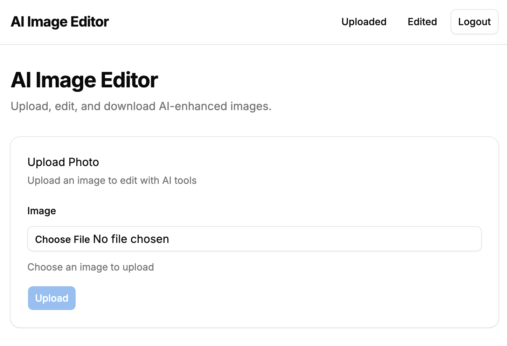
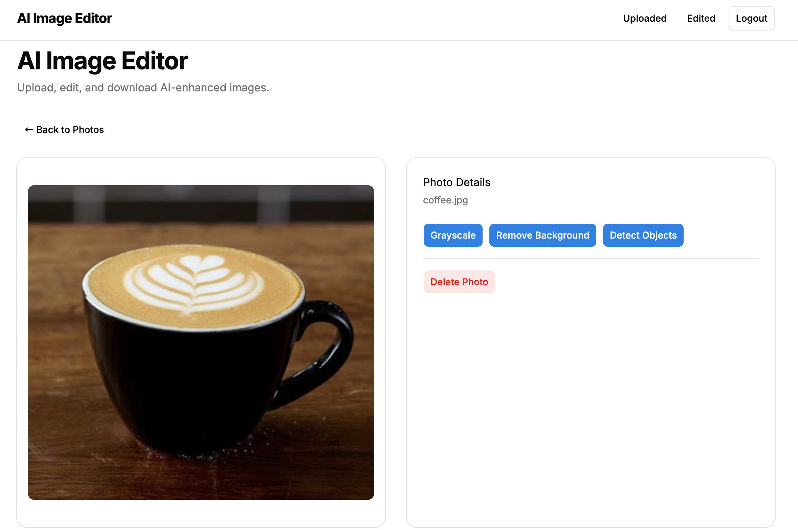
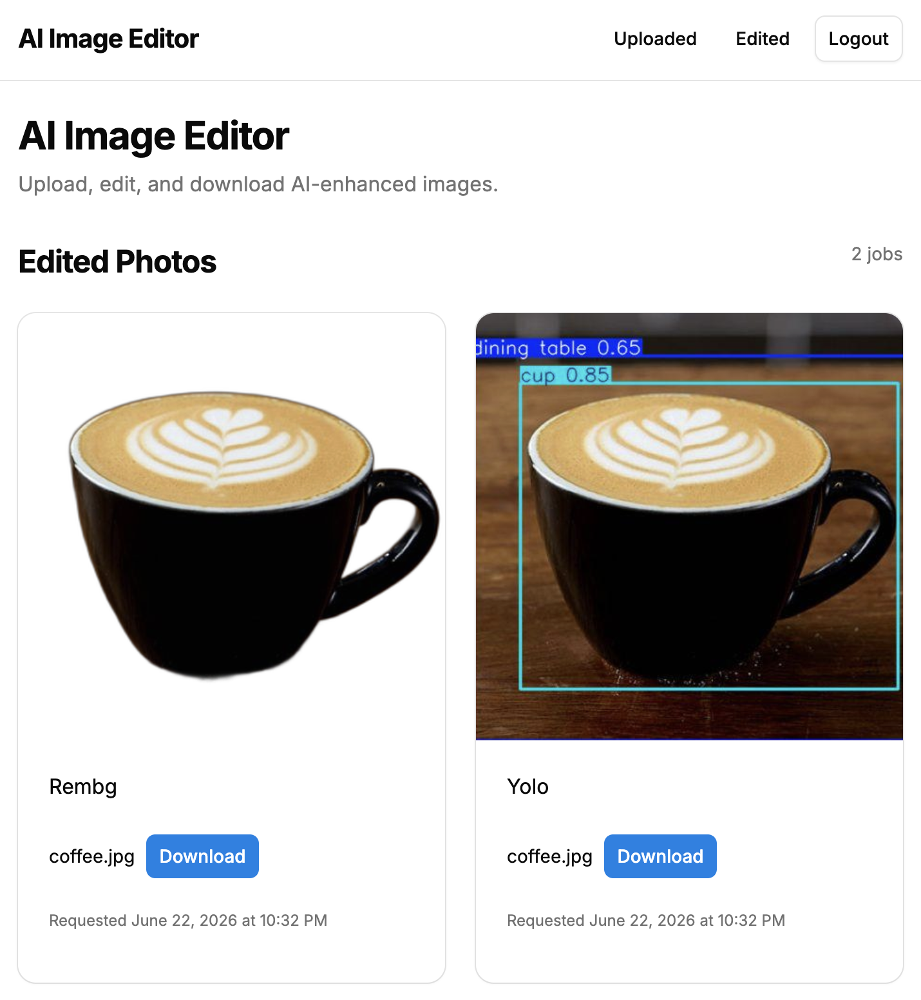

# AI Image Editor

## Project Overview

AI Image Editor is a full-stack web application that allows users to upload images, apply AI-assisted editing, and download the edited images. It uses FastAPI in the backend with Celery workers for image prosessing and S3 to image storage.

Live Demo at: https://www.ai-image.dev
API Demo at: https://api.ai-image.dev/docs

## Background
Initially, I just needed a handy tool that removes the background from an image or makes an image black and white, so that is where the core idea of this project comes from.
In addition, when I was thinking of what to make for my third  portfolio project, I wanted to try out microservice architecture, so naturally I decided to have workers that process images in addition to the FastAPI API gateway, since image processing is computationally taxing and takes more time.

## Features
- AI-powered image editing
- Image uploads
- Background image processing using Celery
- Job status polling
- User registration JWT authentication

## Architecture
```text
[React Client (Vercel)] 
         │
    (HTTPS + CORS)
         ▼
[Application Load Balancer] ────► [FastAPI Gateway (EC2 ARM64)]
                                           │         │
                              (SQL Commit) │         │ (Dispatch Task)
                                           ▼         ▼
                                    [Database]   [Redis Broker]
                                                     │
                                                     ▼
                                            [Celery Worker Cluster] ──► [Amazon S3]
```

## System Design
1. User uploads image
2. Image stored in S3
3. User request edit
4. Edit request sent via Redis queue
5. Celery worker processes image
6. Result uploaded to S3
7. Frontend polls edit job status
8. Download link generated via presigned URL
9. Browser automatically downloads

## Tech Stack
### Background
- FastAPI
- SQLModel
- Alembic
- Pydantic

### Frontend
- React
- React Router
- TypeScript
- Tailwind
- shadcn/ui

### Infrastructure
- Docker
- Celery
- Redis
- PostgreSQL
- AWS S3

### Deployment
- Vercel
- AWS (EC2, S3, RDS, ElastiCache, etc.)

## Running Locally
###
- Docker
- Docker Compose

### Setup
```bash
git clone https://github.com/kotaroyama/AI-Image-Editor-API.git
cd AI-Image-Editor-API
touch .env
```
In .env, setup your environment variables
```bash
docker compose up --build
```
Backend should be live at: http://localhost:8000

## Challenges
### Asynchronous Processing
I first made an error of sending out an edit request from the FastAPI gateway to Celery before commiting the edit request to the PostgreSQL database, causing the Celery workers to not be able to retrieve the requested jobs from the database sometimes. I fixed it by ensuring database commits happen before API sends the request to Celery.

### Cross-Origin Downloads
Honestly, deploying the backend to AWS was a bit of a war this time since it involved setting up multple EC2 instances and setting up S3 and RDS. One issue that I really struggled was configuring and debugging errors related to CORS policies when connecting the frontend to the backend. Resolving these issues required spending a good amount of time configuring AWS S3 console and investigating the frontend behavior in browser.

## Screenshots



